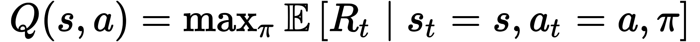
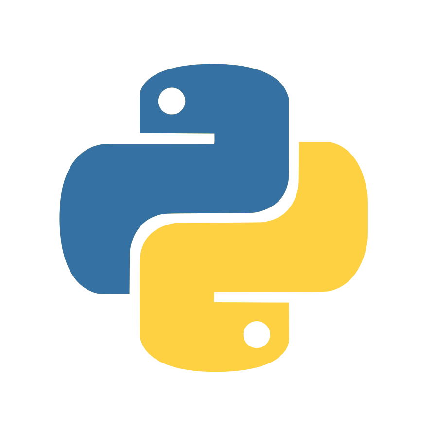
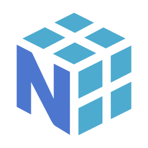
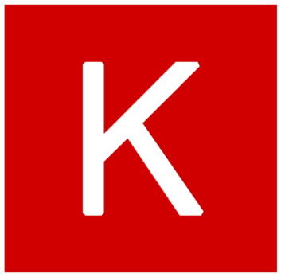
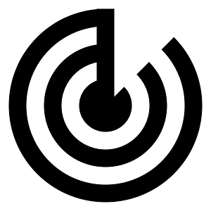
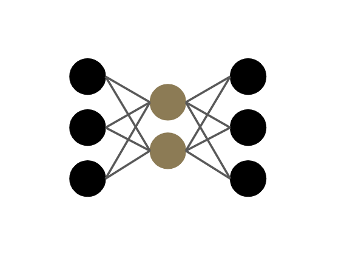
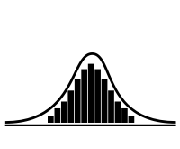
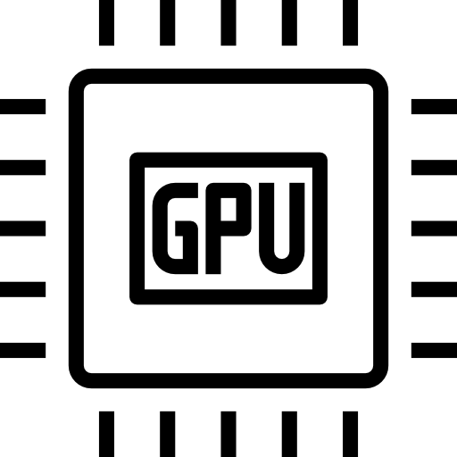
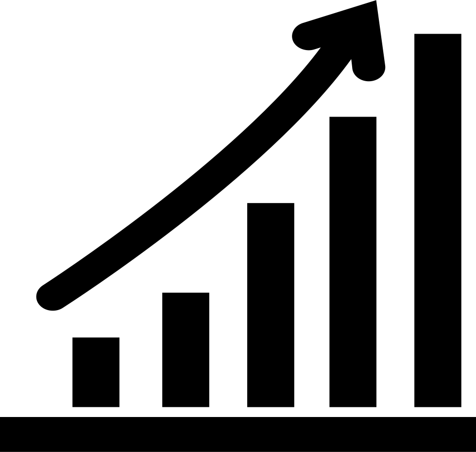
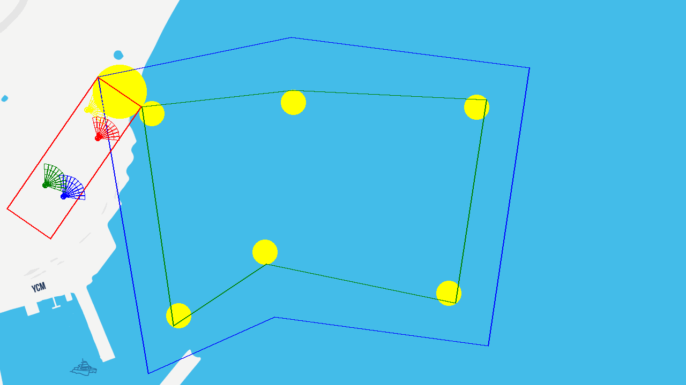

# Stage RL
Ce github contient l'essentiel du codes réalisé lors de mon stage de 2ème semestre de Master 1. L'objectif du stage était de produire un modèle de Reinforcement Learning compétitif (multi-agent) devant faire le maximum de tours d'une piste avec des obstacles. Les robots sont contraints par une batterie et un système d'accélération/rotation peu maniable.

# Méthodes
## Base 
Le coeur du stage est le *Q-Learning*, une famille d'algorithmes par renforcement dans laquelle les agents apprennent à estimer la fonction Q(s, a) qui associe pour chaque couple état-action une valeur dans R. Cette valeur correspond à la somme décomptée des récompenses au long de la trajectoire de l'agent. (Mnih et al. 2013)

  

## Supplément
Pour améliorer les performances des agents, des stratégies additionnelles ont été mises en place : **Dueling DQN** (Wang et al. 2015) ; **Double Q-Learning** (Hasselt et al.) ; **Prioritized Experience Replay** (Schaul et al.) ; **QR-DQN** (Dabney et al. 2017). 
Des algorithmes alternatifs au Q-Learning ont également été proposés : **DDPG** (Lilicrap et al. 2015) ; **PPO** (Schulman et al. 2017).
Et une stratégie de parallélisation avancée a été mise en place en s'inspirant de **Accelerated Methods for Deep Reinforcement Learning** (Stooke et Abbeel 2018). 

# Technologies
Bien que l'environnement soit une sous-classe de gym.Env, l'entiereté du code a été implémenté personnellement à l'aide de la bibliothèque Numpy principalement. L'aspect Deep Learning utilise Tensorflow 2.13.1 et Tensorflow Keras.
La parallélisation s'est effectué à l'aide des librairies threading et multiprocessing.

  
  
  
  

# Description

##  Contexte
4 agents s'affrontent lors d'une course, ils doivent atteindre le maximum de "points de passage" (gateways) tout en évitant les obstacles ou les concurrents. Pour cela ils peuvent choisir entre plusieurs actions : freiner fortement ou légèrement, garder une vitesse constante, accélérer légèrement ou fortement ; idem pour l'orientation : tourner fortement ou légèrement à droite, cap constant, tourner fortement ou légèrement à gauche. Cela se traduit par +/-1.5 pour l'accélération forte, +/-0.6 pour l'accélération légère dans la vitesse et +/-15°, +/-6° dans l'orientation. Cela se combine alors en 25 couples d'actions distincts. 

##  Observations 
Les observations de l'agent se résument en 2 types, d'une part l'observation extérieur du circuit qui est pris sous forme d'une cône devant l'agent (il voit dans un cône de 110° centré en sa direction et d'une distance de 40m, on considère qu'un obstacle dans le cône obstrue la vue et empêche de voir derrière). La deuxième catégorie d'observation concerne le robot en lui même : orientation, vitesse, direction de l'objectif, direction de l'objectif d'après (objectif = gateway), distance à l'objectif et batterie.

##  Le réseau
2 types de réseaux qui diffèrent sur la fusion des modalités d'observation ont été proposés. Le modèle 1 correspond à une fusion "précoce" des modalités, on fait passer le cône dans une convolution 1D avec un kernel de 1 (car il n'y a pas de corrélation spatiale entre les éléments) puis on tile les informations du robot (après les avoir embeddé) de façon à obtenir 2 matrices 220x32 que l'on peut alors concaténer et refaire passer dans des convolutions 1D avant de Flatten.
La 2ème approche est plus simple étant donné qu'elle Flatten le cone embeddé par une convolution 1D puis concatène le résultat avec les informations du robot embeddées en un seul vecteur de 220x32+32 éléments. On la désigne sous le nom de fusion "tardive".

#  Sortir de la simulation
Un aspect particulièrement intéressant du stage a été d'appréhender la sortie de l'agent hors simulation et essayer de le rendre robuste à de potentielles variations en utilisant des Variational Auto Encoder. 
On distinguera 2 types d'approches dans ce contexte : 
- L'utilisation d'un *VAE* pré-entrainé sur des observations côniques avant d'injecter le vecteur au réseau
- L'utilisation d'une couche variationnelle entre le Flatten et l'estimation des Q-valeurs.

#   Optimisation & parallélisation
Les entrainements de Reinforcement Learning peuvent être très coûteux en terme de ressources CPU:GPU et de temps. Pour limiter le problème, l'utilisation du calcul matriciel offert par Numpy a largement été sollicité. Certains bonnes pratiques ont également été mise en place : allocation mémoire en avance avec des np.zeros, utilisation des librairies random et math pour les opérations ponctuelles, tests de performances dans des boucles for...

La parallélisation du problème RL n'est pas triviale et nécessite une certaine organisation. 
La parallèlisation de premier niveau qui a été mise en place consiste à créer des *WorkerProcess* avec la librairie multiprocessing. Chaque Worker héberge N environnements de 4 agents et chaque script principal qui est associé à 1 GPU crée M Workers. Cela résulte en M\*N\*4 observations simultanées. (Pas réellement simultanées étant données que les N environnements de chaque Worker sont jouées séquentiellement). 
On attend donc de recevoir ce batch d'observations pour produire un batch d'actions et stockées l'ensemble dans transitions (s, a, r, s') dans une mémoire commune.

La parallélisation de second niveau consiste simplement à mettre tout cet entrainement dans un Thread de la librairie Threading, étant donné que ce n'est pas le script principal mais les workers qui consomment les ressources CPU on peut se permettre d'accumuler plusieurs threads. Avec un système de verrous on fait accéder les Threads au GPU commun ce qui permet de le solliciter davantage. 
Chaque Thread possède des informations uniques ce qui permet d'entrainer des modèles en parallèles sur le même GPU

#  Résultats 
Le Q-Learning classique du DQN offre des résultats assez limités, c'est en partie du à l'uniformité du reward étant donné qu'une action impacte peu l'environnement. Cependant en implémentant le QR-DQN et une variante Dueling du QR-DQN (nommée comme DQR-DQN) on arrive à significativement améliorer les performances en doublant presque le nombre de points de passage atteints. Et cela même lors de l'utilisation de réseaux variationnels. Plus de détails dans les graphiques.

Le Dueling QR-DQN en inférence :

*(Le fond de carte est purement a but décoratif, les cartes sont générées aléatoirement. La zone rouge désigne la zone de départ qui n'est plus considérée comme du circuit une fois le 1er objectif atteint)*

Une des limites qui apparait dans cette petite démonstration est qu'une fois les positions de départ trouvées il devient très compliqué de dépasser un concurrent. Déjà car les agents possèdent le même modèle alors si un comportement permettant de passer en tête existait, le 1er robot l'aurait également choisi. Deuxièmement car ils vont déjà à la limite de la vitesse qui les restreint, à la manière des courses de formule 1 les revirements de situation sont assez rares. Bien que le robot rouge réussisse à un moment à passer en tête.

# Références

- Mnih et al. (2013) [Playing Atari With Deep Reinforcement Learning](https://www.cs.toronto.edu/~vmnih/docs/dqn.pdf)
- Wang et al. (2015) [Dueling Network Architectures for Deep Reinforcement Learning](https://arxiv.org/pdf/1511.06581)
- Hasselt et al. (2015) [Deep Reinforcement Learning with Double Q-learning](https://arxiv.org/pdf/1509.06461)
- Schaul et al. (2017) [ Prioritized Experience Replay](https://arxiv.org/pdf/1511.05952)
- Dabney et al. (2017) [Distributional Reinforcement Learning with Quantile Regression](https://arxiv.org/pdf/1710.10044)
- Schulman et al. (2017) [Proximal Policy Optimization Algorithms](https://arxiv.org/pdf/1707.06347)
- Lilicrap et al. (2015) [Continuous Control With Deep Reinforcement Learning](https://arxiv.org/pdf/1707.06347)

