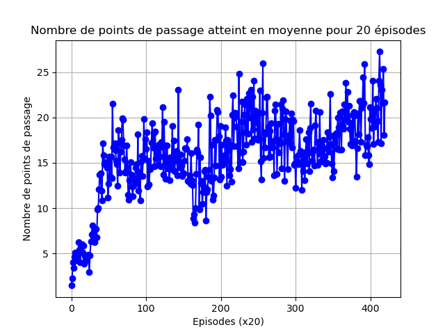
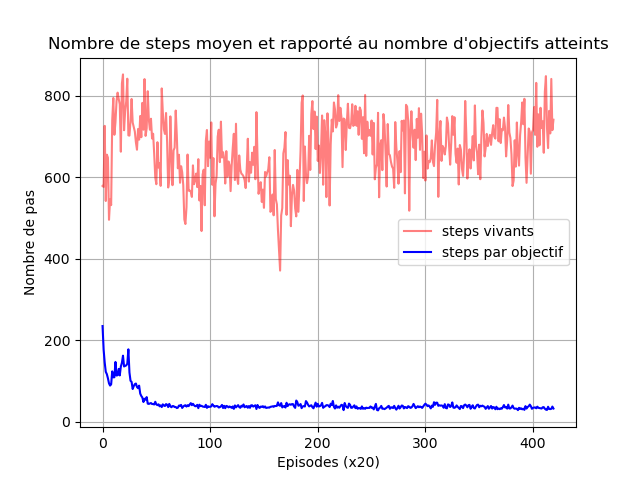

# Evaluation des entrainements

L'évaluation des entrainements de Reinforcement Learning se fait généralement en observant la somme décomptées des rewards par épisode, ainsi au fil des entrainement on peut observer que l'agent tend à maximiser cette somme.
Une autre manière de faire et proposée ici est d'observer des métriques artificielles en lien avec la tâche, deux types de métriques principales émergent :
- Le nombre de points de passage franchis 
- Le nombre de pas 

La première métrique nous renseigne sur les performances brutes de l'agent, à quel point il a compris la tâche principale qui est de faire des tours de circuits.
La deuxième métrique permet de vérifier la capacité de survie des agents, ce qui est un point important en terme d'évitement de colisions et endurance.
Enfin en divisant la deuxième métrique par la première on obtient le nombre de pas par points de passage ce qui peut refléter l'efficacité de l'agent a effectuer une tâche.

  
  

Dans l'exemple ci-dessus, une courbe d'évolution du nombre de points de passages franchis ainsi que les steps associés : en rouge les steps survécu, en bleu les steps par objectif.
Les cartes sont aléatoires et peuvent être de difficulté différentes. Cependant les performances sont moyennées entre les 4 agents de la carte ainsi que pour 20 épisodes ce qui permet de lisser les courbes.

Les agents sont entrainés pour 20 000 épisodes en général mais si la courbe semble pouvoir croître davantage, il peut être intéressant de prolonger l'entrainement.

*(Lors de l'entrainement, 2 courbes additionnelles sont produites : le nombre de tours (multiplié par 10) associé au nombre de steps (divisé par 10) & une somme des rewards non décomptés ce qui peut apporter un biais en comparaison avec une courbe d'entrainement commune.)*