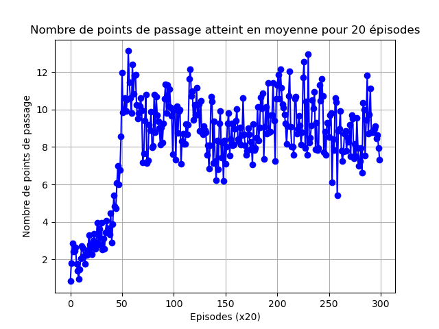
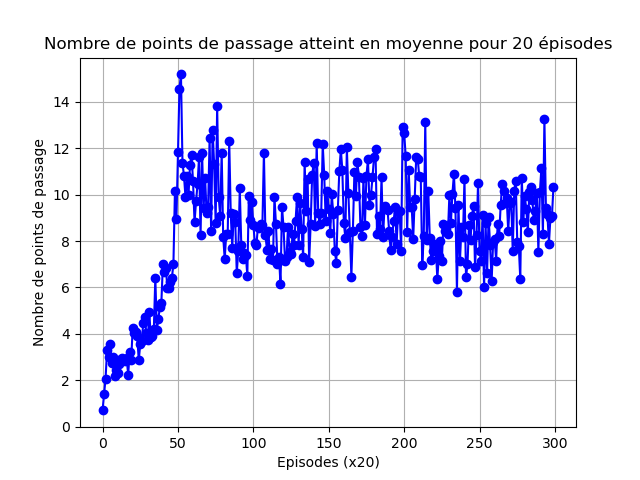
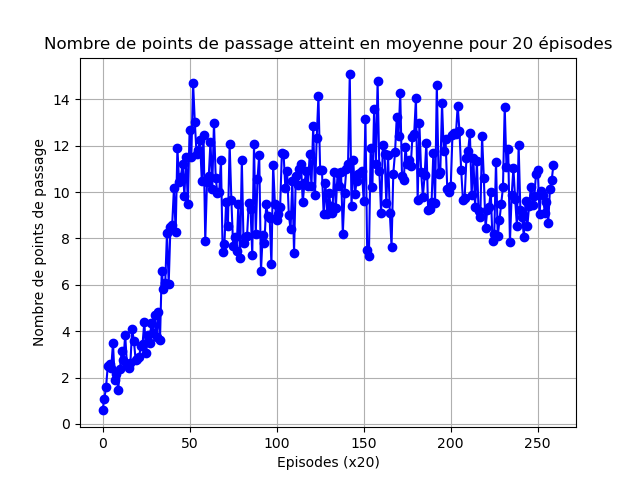

# Commentaire

Les 3 courbes d'entrainement *model2_(dim_vae)* ont été interrompues avant la fin des 20 000 épisodes car les modèles non distribuées ont été jugées trop mauvais et poursuivre l'entrainement aurait été une perte de ressources et de temps. Il faut néanmoins noter que le nombre de gateways franchis est équivalent à celui d'un DQN recevant en entrée le cône réel, pas de baisse de performances à constater.  

La dimension latente de l'auto-encoder n'influence pas réellement les performances et pour cause, même le plus petit modèle réussit à restituer avec fidélité l'input.

  
  
  

*(dans l'ordre, dimension 256, 512, 1024)*

